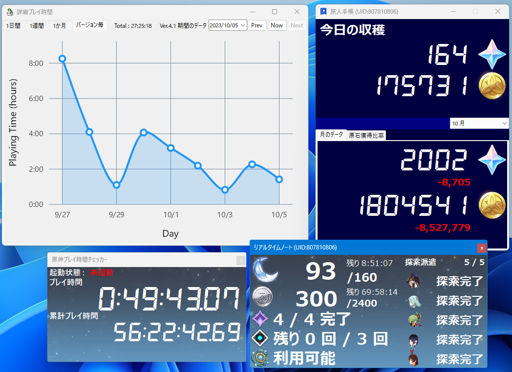

# 原神チェッカーについて

「原神チェッカー」は原神を便利に活用できる機能を備えたアプリです。

Windows版のみ対応。

機能を順次追加中ですのでお待ちいただけると幸いです。

# 機能一覧
### 利用可能な機能
* ゲームプレイ時間の計測
* リアルタイムノート(樹脂及び探索情報等)
* 樹脂・洞天宝銭・探索派遣の通知機能
* 旅人手帳 (原石やモラの獲得データ等)
* 旅人手帳の詳細表示(モラ・原石獲得履歴)
### 追加予定機能
* 複数アカウントの連携
* 戦績データの表示
* 螺旋情報や旅人手帳のアーカイブ機能
* 拡張されたテイワットマップ
* 育成状況の確認や拡張された育成計算機

# アプリの終了方法
タスクトレイから「原神チェッカー」を右クリックして「終了」を選択してください。

# 免責事項・注意事項
* 当アプリは、マクロ、ボット、メモリの読取り、ゲームアセットデータの解析や抽出、DLLの埋め込みなどをいたしません。当アプリを通じてゲーム本体に直接干渉しないことをお約束いたします。
* 使用しているアカウントのCookie及び取得したデータは全てローカルコンピューターに保存されます。外部に送信することはありません。
* 当アプリケーションはオープンソース(Mit License)です。二次配布は禁止とします。
  共有する場合は必ずこのリンクから共有をし、ダウンロードしてください。https://github.com/Misaki0331/Genshin-Checker/releases/latest
* 当アプリはゲームを通じてプレイヤーが有利にゲーム進行し、もしくは正常なサービス利用を妨げる意図や助長をするものではありません。
* 当アプリの一部コンテンツ、素材の著作権は「miHoYo」及び「HoYoverse」に帰属します。また、当アプリは「miHoYo」、「HoYoverse」、及び同社が運営しているゲーム「原神」に一切関係ありません。
* 当アプリの使用に関連して、作者はいかなる不利益、損害、または問題に対して一切の責任を負いません。アプリケーションの利用は、ユーザーの自己責任で行われるものとし、作者はいかなる種類の明示的または黙示的な保証も提供しません。アプリケーションの使用により生じたいかなる損害についても、作者は責任を負わないものとします。

以上の免責事項をご理解し、ご承諾いただいた上で、原神チェッカーをご利用いただきますようお願い申し上げます。

